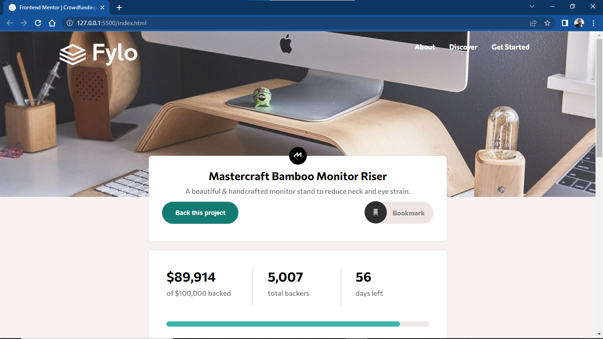
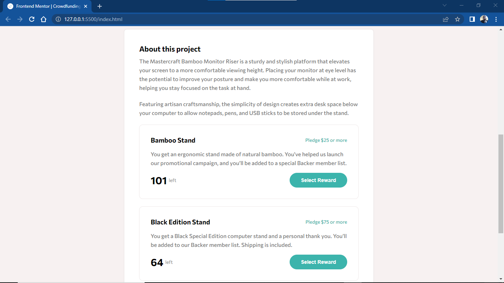
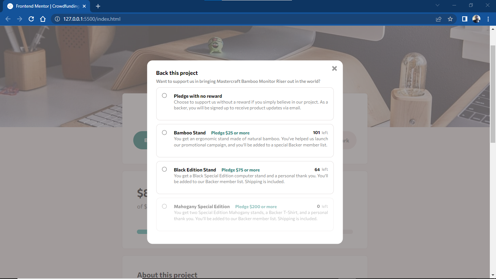
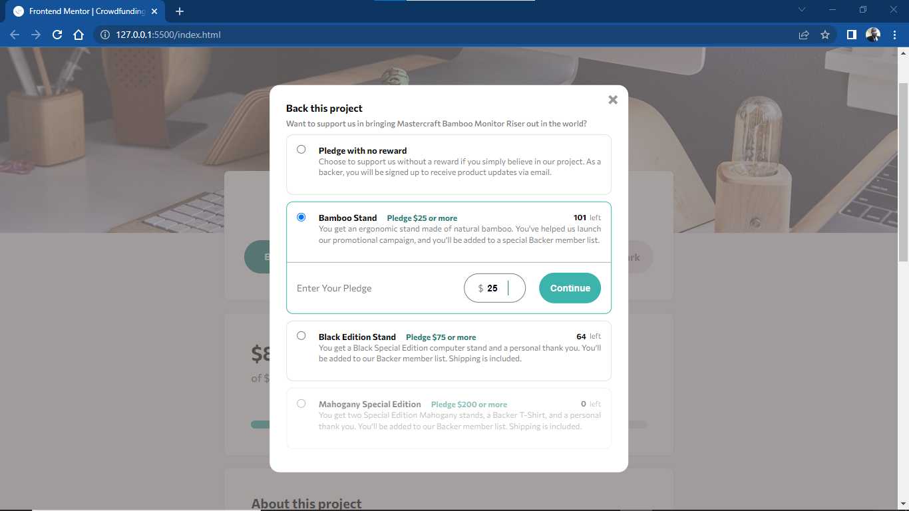
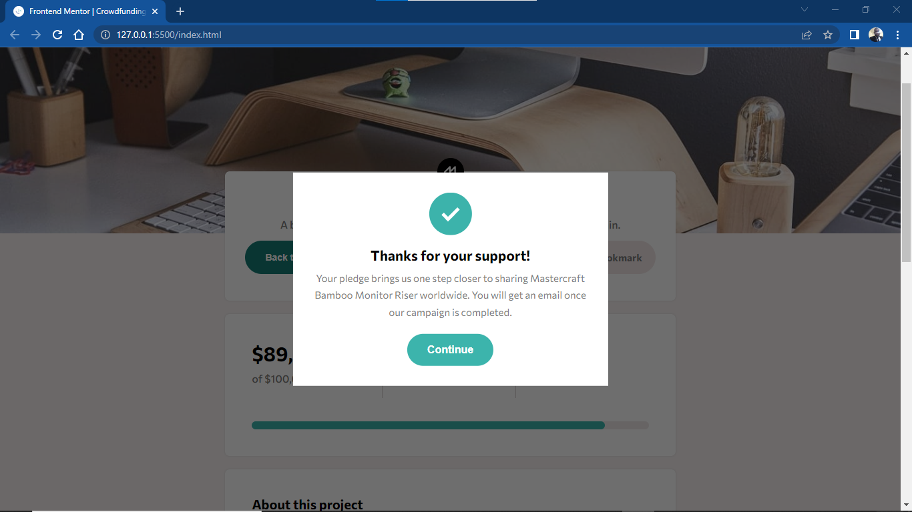
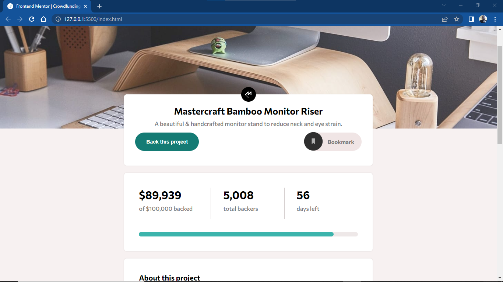
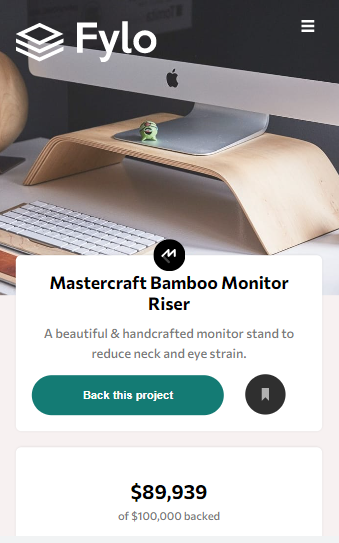
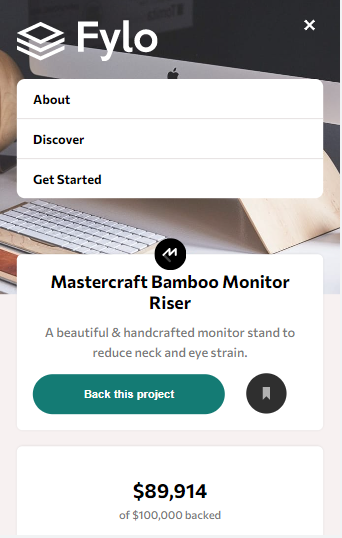
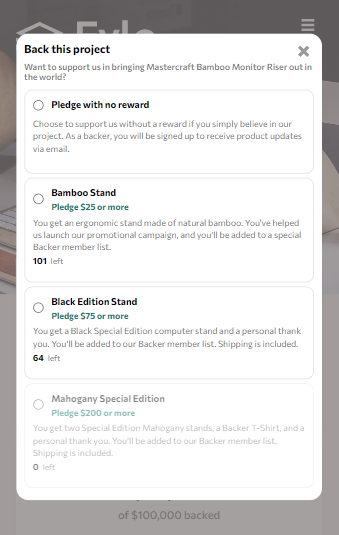
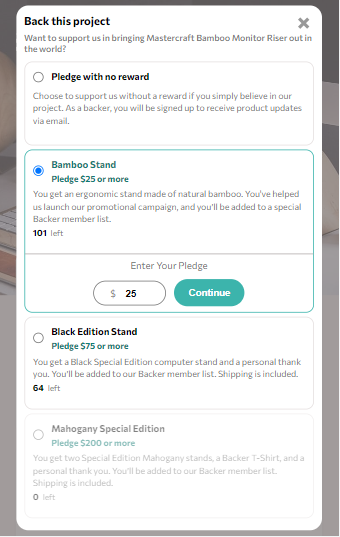

# Frontend Mentor - Crowdfunding product page solution

This is a solution to the [Crowdfunding product page challenge on Frontend Mentor](https://www.frontendmentor.io/challenges/crowdfunding-product-page-7uvcZe7ZR). Frontend Mentor challenges help you improve your coding skills by building realistic projects.  

## Table of contents

- [Overview](#overview)
  - [The challenge](#the-challenge)
  - [Screenshot](#screenshot)
  - [Links](#links)
- [My process](#my-process)
  - [Built with](#built-with)
  - [What I learned](#what-i-learned)
  - [Continued development](#continued-development)
  - [Useful resources](#useful-resources)
- [Author](#author)
- [Acknowledgments](#acknowledgments)

## Overview

### The challenge 

Users should be able to:

- View the optimal layout depending on their device's screen size
- See hover states for interactive elements
- Make a selection of which pledge to make
- See an updated progress bar and total money raised based on their pledge total after confirming a pledge
- See the number of total backers increment by one after confirming a pledge
- Toggle whether or not the product is bookmarked

### Screenshot

### Links

- Solution URL: [www.saajevessolutionforthisproject.com](https://your-solution-url.com)
- Live Site URL: [www.saajeveslivesiteforthisproject.com](https://your-live-site-url.com)

## My process

### Built with

- Semantic HTML5 markup
- CSS custom properties
- Flexbox

### What I learned

In this current Project on html, css and js, that I am currently engaging on, this would have to be the most time consuming project I have engaged in. There are lots of details that has to be paid attention to and which has to be seen in ones coding. My JS file may seem off but, the functionalities needed for this project to meet the required was met. What I learnt concerning this project is that time is consumed when a website to be coded contains too much details and one has to pay attention to this many details.

### Continued development

Still more to develop on my web development skills. JS knowledge has to be improved on.
One more important part to work on is styling to look nice on mobile view. My styling in this project is not looking nice. Bellow is a snippet of this project on mobile view. You can view the live site by clicking [here](https://your-live-site-url.com)

### Useful resources

A lot of resources was helpful not just in this project but from the beginning of my learning of web development.
- [w3schools](https://www.w3schools.com) 

- [freecodecamp](https://www.freecodecamp.com)

- [youtube](https://www.youtube.com)

- And lots more. Surely, I will always recommend them days in and days out

## Author

- Github - [go to my github account](https://github.com/SAAJEVES)
- Frontend Mentor - [go to my frontend mentor account](https://www.frontendmentor.io/profile/SAAJEVES)
- Twitter - [go to my twitter account](https://www.twitter.com/saajeves)
- LinkedIn - [go to my linkedin account](https://www.linkedin.com/in/samuel-ajagun-020283150)

## Acknowledgments

I would love to acknowledge [a very good friend of mine and mentor](https://github.com/wisdomosara) for his immense contribution on helping me in this project. You are well appreciated.